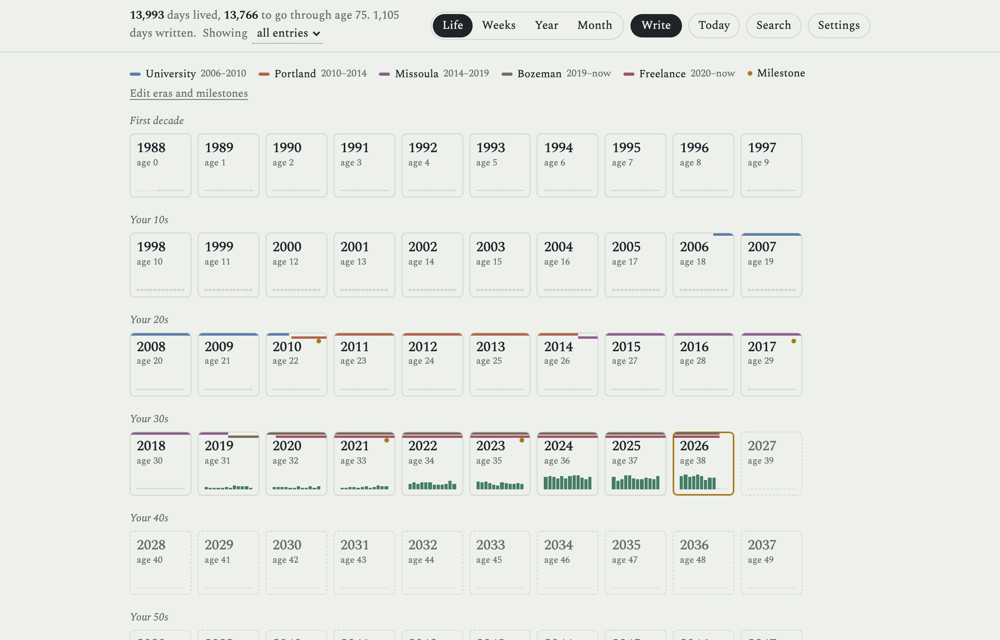
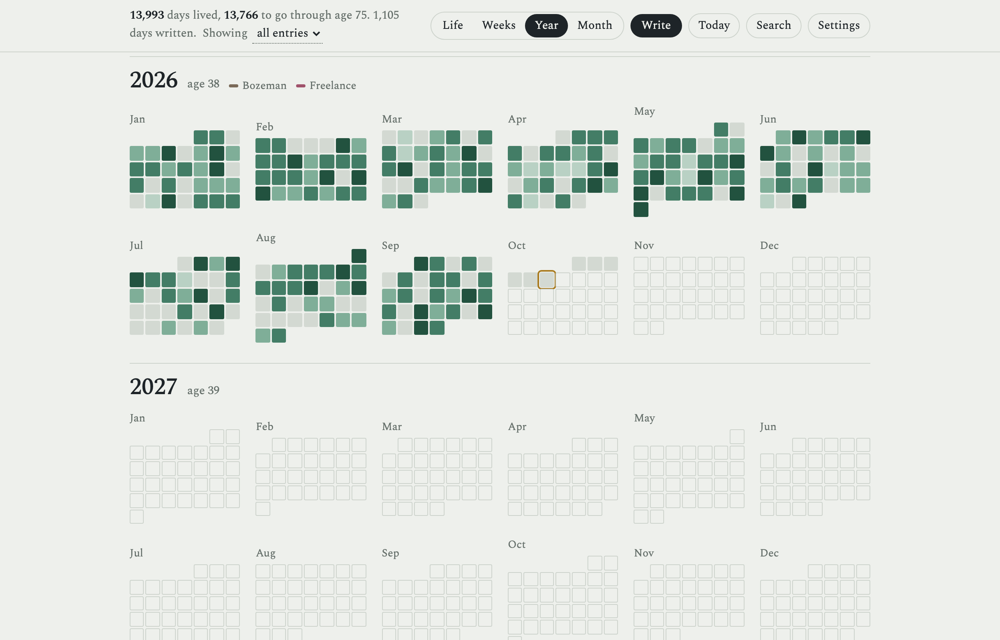
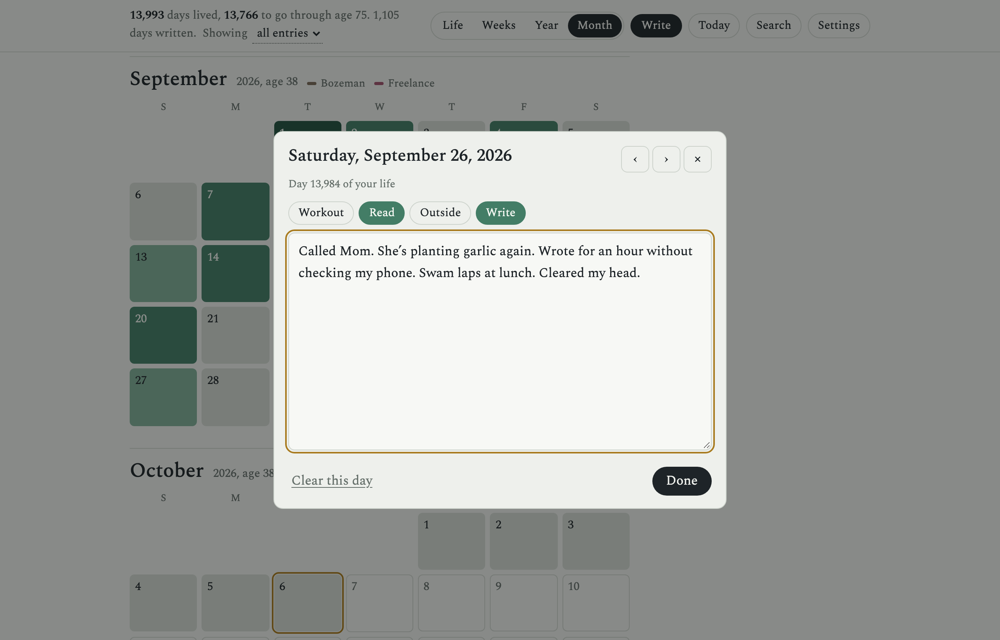
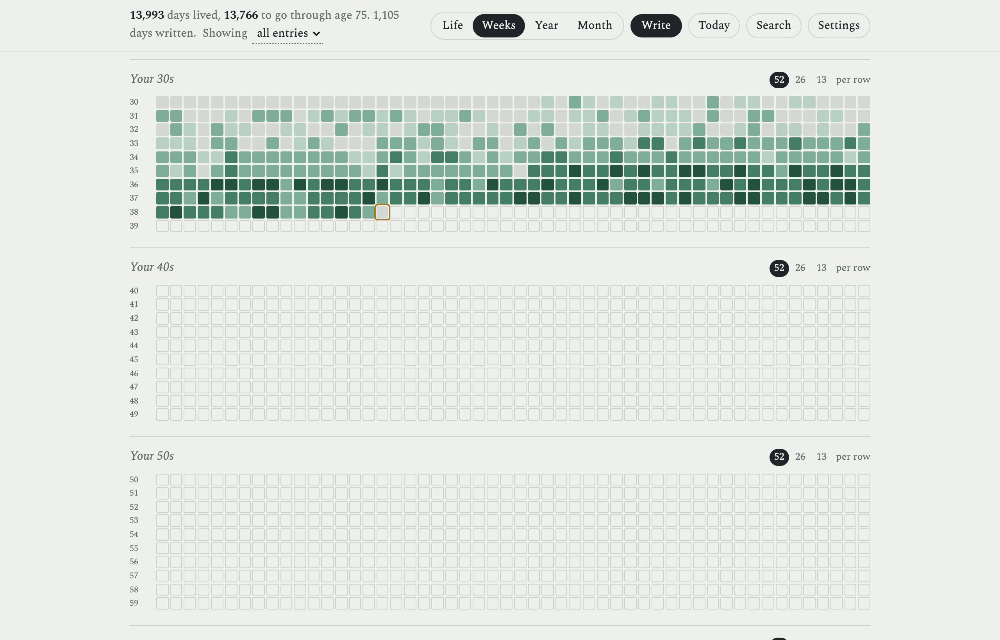
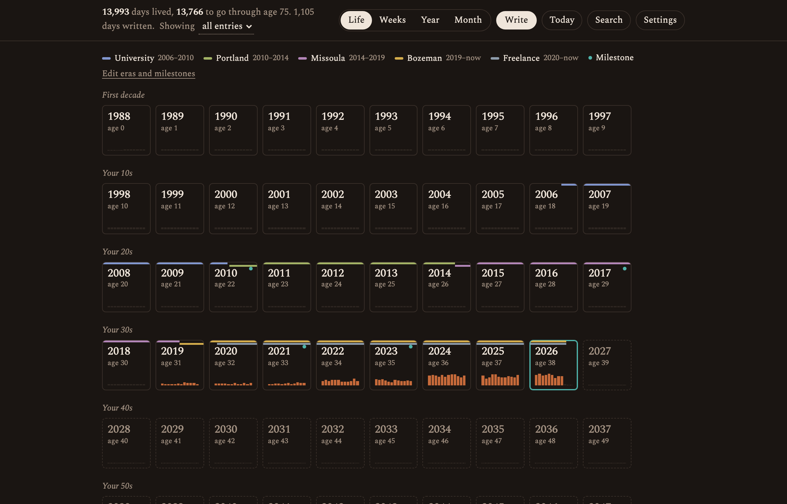
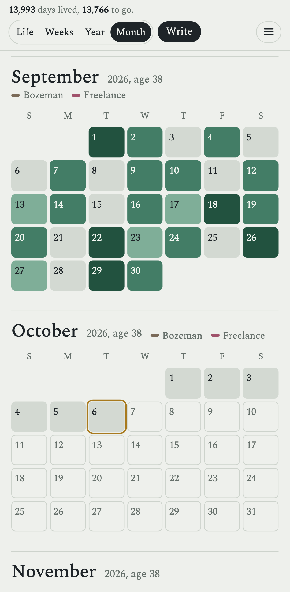
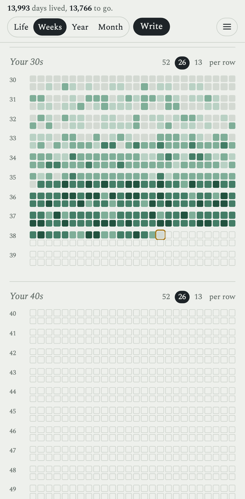

# Lifetime Journal

[](https://github.com/joelwilsonmt/lifetime-journal/actions/workflows/ci.yml)
[](https://github.com/joelwilsonmt/lifetime-journal/actions/workflows/docker.yml)
[](LICENSE)

A self-hosted daily journal laid out as your whole life. See about 75 years at
once, zoom into a year, a month, a day, and write. Lived time is filled in,
the time you have left is outlined, and each day is shaded by how much you
wrote. A small memento mori that also happens to be a journal.

Every day is a plain markdown file, so the data folder doubles as an Obsidian
vault, and the whole thing runs as one Docker container on your own server.



| | |
| --- | --- |
|  |  |
| **Year:** twelve months at a glance. | **Day editor:** a note and activities, saved as you type. |
|  |  |
| **Weeks:** your life in weeks, from each birthday. | **Themes:** five palettes, light or dark, four typefaces. |

<p align="center">
  
  &nbsp;&nbsp;
  
</p>

## Features

- **Four zoom levels on one continuous scroll:** Life, Weeks, Year and Month.
  Zooming keeps your place, and the thing you click grows into what it opens.
- **A fast daily habit:** *Write* (or `N`) opens today. Notes autosave, with a
  visible save status. Swipe or use ‹ › to move between days.
- **Activities** you choose (Workout, Read, Outside…) as one-tap chips, and an
  activity **lens** that shades only the days with that activity.
- **Eras and milestones:** label stretches of life (a city, a school, a job)
  and single days; they're drawn across the calendar.
- **Search** across every note and activity (`/`).
- **Plain markdown storage**, one file per day, editable in Obsidian or any
  editor. Edits made outside the app show up, and the app catches conflicts
  instead of overwriting them.
- **Forgiving:** clearing a day moves it to a trash folder for 30 days.
- **Themes:** Pine, Ember, Tide, Dusk and Ledger, each light and dark, plus
  Spectral, Besley, Instrument Sans or Courier Prime. Synced across devices.
- **Installable** on phones as an app (over HTTPS), opening straight to
  today's entry.
- **Keyboard:** `1`–`4` switch views, `N` writes today, `T` jumps to today,
  `/` searches, `Esc` zooms out.

## Install with Docker

Images for `linux/amd64` and `linux/arm64` are published to
`ghcr.io/joelwilsonmt/lifetime-journal` on every push to `main` and on version
tags. On your server:

```sh
mkdir -p /opt/docker/lifetime-journal && cd /opt/docker/lifetime-journal
curl -fsSLO https://raw.githubusercontent.com/joelwilsonmt/lifetime-journal/main/docker-compose.yml
curl -fsSL  https://raw.githubusercontent.com/joelwilsonmt/lifetime-journal/main/.env.example -o .env
sed -i "s/^APP_UID=.*/APP_UID=$(id -u)/; s/^APP_GID=.*/APP_GID=$(id -g)/" .env
mkdir -p data
docker compose up -d
```

It listens on `127.0.0.1:3075`. There's no login, so keep it private: the
intended setup is [Tailscale](https://tailscale.com), which also provides the
HTTPS that phones need to install it:

```sh
sudo tailscale serve --bg --https=443 http://127.0.0.1:3075
# → https://<server>.<tailnet>.ts.net
```

Upgrade with `docker compose pull && docker compose up -d`, or pin `VERSION`
in `.env` to a release. [DEPLOY.md](DEPLOY.md) covers every setting, building
from source, shipping an image without a registry, backups and restores.

## Your data

```
data/
  settings.json                     birth date, activities, eras, theme…
  journal/2026/09/2026-09-30.md     one file per day
  .trash/                           cleared days, kept 30 days
```

```markdown
---
activities: [Workout, Read]
updated: 2026-09-30T18:06:30.300Z
---

Walked the river trail before work; the cottonwoods are turning.
```

Back up the `data` folder and you have everything. Extra frontmatter you add
in Obsidian is kept when the app rewrites a file. To restore a cleared day,
move it from `data/.trash/` back to `data/journal/YYYY/MM/YYYY-MM-DD.md`.

The original single-file prototype (`prototype/index.html`) kept entries in the
browser. Its JSON export imports through **Settings → Import JSON**, or:

```sh
docker compose exec lifetime-journal node dist/server/cli/import.js /data/export.json
```

## Development

Requires Node 22.18+ and pnpm (`corepack enable`).

```sh
pnpm install
pnpm dev          # http://localhost:3075, data in ./data
pnpm dev:demo     # http://localhost:3077, sample data in ./demo-data
pnpm test         # unit tests
pnpm test:e2e     # build, then Playwright (desktop + phone) on a fresh data dir
pnpm typecheck
pnpm check        # Biome lint + format (pnpm format to fix)
pnpm screenshots  # regenerate docs/screenshots from the demo (run dev:demo first)
```

Stack: React 19 + Vite + CSS Modules on the front, a small Hono server on
Node, TypeScript throughout, Zod for validation, Vitest and Playwright for
tests. The server runs straight from TypeScript in development (Node strips
the types) and is compiled with `tsc` for production.

```
src/client   React app: views, dialogs, styles (themes in styles/global.css)
src/server   Hono API, markdown storage, trash, settings, import CLI
src/shared   Date helpers, intensity level, types shared by both
e2e/         Playwright tests
```

### API

| Method | Path | |
| --- | --- | --- |
| GET | `/api/summary` | Every day with an entry: `{ days: { date: level }, activities: { date: [...] } }` |
| GET / PUT / DELETE | `/api/days/:date` | One day. PUT `{ note, activities, base? }`. An empty day moves to the trash. A stale `base` version returns 409 with the current entry. |
| GET | `/api/search?q=` | Days whose note or activities contain every term, newest first |
| GET / PUT | `/api/settings` | Birth date, span, activities, eras, milestones, appearance |
| GET | `/api/export` | Everything, as JSON |
| POST | `/api/import` | Load a JSON export |
| GET | `/api/health` | Liveness, data-folder writability and version |

There's no authentication. Every `/api` route except health passes through
`src/server/auth.ts`, which is where it would go.

## License

[MIT](LICENSE) © Joel Wilson
